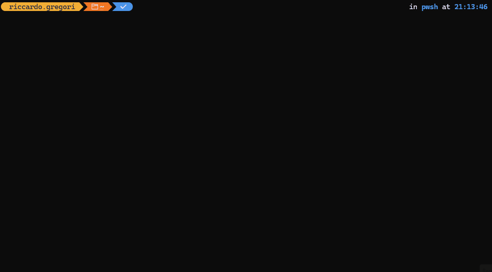

# Greg.Xrm.Command ⁓ aka PACX 🔧


[OpenSSF Best Practices badge: in progress](https://www.bestpractices.dev/)


## Overview 💻

**PACX** is a free to use, **open source**, command line based, utility belt for Dataverse.
It's aim is to extend the capabilities of [PAC CLI](https://learn.microsoft.com/en-us/power-platform/developer/cli/introduction?tabs=windows) providing a lot of commands designed by **Power Platform Developers** to:

- help with the automation of repetitive tasks 🤖
- provide an easy access to hidden gems that are provided by the platform only via API 🫣
- make development and deployment faster and more efficient 🚀

It's also a lot more than that. Built with an [XrmToolbox](https://www.xrmtoolbox.com/) like plugin-based approach in mind, it is also an easy-to-use platform to develop your own tools and extensions.

## Installation 🛠️

The tool can be installed as a `dotnet` global tool using the following command:

```powershell
dotnet tool install -g Greg.Xrm.Command
```

To update the tool to a newer version

```powershell
dotnet tool update -g Greg.Xrm.Command
```

PACX now includes a separate `Greg.Xrm.Command.Mcp` host project for the MCP server boundary.
The CLI `mcp start` command delegates into that host so the MCP surface can evolve independently from the CLI engine.

PACX also defines a native package format for cross-platform deployment bundles. See the conductor package format and distribution docs for the manifest and layout. Use `pacx package init`, `pacx package add`, `pacx package remove`, `pacx package list`, `pacx package sync`, `pacx package fix`, `pacx package publish`, `pacx package release`, `pacx package validate`, `pacx package build`, `pacx package show`, and `pacx package deploy` to manage packages. `pacx package init --kind` can scaffold a `bundle`, `solution`, or `data` package, and the `solution` and `data` starters are valid immediately. `pacx package add`, `pacx package remove`, `pacx package sync`, and `pacx package fix` normalize the manifest kind from the package contents. `pacx package list` and `pacx package validate` show the kind contract inline. `pacx package deploy --dry-run` prints a readiness table for each deployment step. `pacx package publish --version` and `pacx package release --version` can stamp a release-tag version into the published artifacts. The fork-owned `release-tag.yml` workflow keylessly signs the release tag with Sigstore before publish, and `release.yml` handles NuGet publishing, GitHub Releases, PACX package artifacts, a CycloneDX SBOM for the release solution, Sigstore signing for the release assets, and SLSA provenance for the release artifacts; it also has a `workflow_dispatch` dry-run mode for smoke verification before a real tag release. A dedicated `release-smoke.yml` workflow triggers that dry-run path with a `v0.0.0-ci-smoke` tag by default.

## Usage 🚀

You can get the list of the available commands by running:

```powershell
pacx --help
```

- For the current package format and distribution model, see the conductor package format and distribution docs.
- For articles, how-tos, tutorials, or real life usage examples [follow my LinkedIn](https://www.linkedin.com/in/riccardogregori/) profile.

## Interactive mode 🖥️

PACX can also be used in interactive mode, which allows you to run multiple commands in a cli-style UI.
To start PACX in interactive mode, simply run:

```powershell
pacx --interactive
```



**Interactive mode** provides the following features:

- Command tree **navigation** (downwards and upwards)
- **Search** the list of commands and namespaces
- **Execute** commands directly from the interactive mode
- **Inline help** for commands and namespaces
- **On demand help** for command options (via `/?`)
- **Colorized output** for better readability
- `mcp start` now launches the separate MCP host boundary.

## Extensions 🧩

You can extend PACX capabilities in 2 different ways:

- 🌟 Extending the PACX core features is tracked in the conductor implementation plan.
- 📦 Creating your own Tools should follow the PACX package format and release plan docs: a tool is a set of PACX commands packaged in a single dll file that can be deployed locally for single use scenarios, or can be made available to the community via NuGet. **This is the preferred approach to add context specific commands**.

If you have created an interesting extension and want to share it with the community, document it in the fork and publish it through your own release notes or package feed.

## Maintainers

This fork is maintained independently from the original upstream repository.
